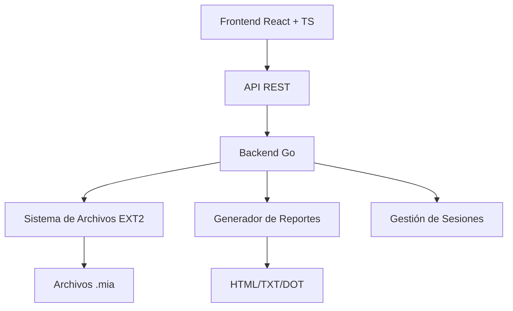

# Manual Técnico - Sistema de Archivos EXT2 Simulado
## ExtreamFS v2.0

---

## 📋 Tabla de Contenidos

1. [Introducción](#introducción)
2. [Arquitectura del Sistema](#arquitectura-del-sistema)
3. [Estructuras de Datos](#estructuras-de-datos)
4. [Comandos Implementados](#comandos-implementados)
5. [Sistema de Journaling](#sistema-de-journaling)
6. [Operaciones Avanzadas](#operaciones-avanzadas)
7. [Interfaz de Usuario](#interfaz-de-usuario)
8. [Reportes del Sistema](#reportes-del-sistema)
9. [Consideraciones Técnicas](#consideraciones-técnicas)
10. [Testing y Validación](#testing-y-validación)
11. [Conclusiones](#conclusiones)

---

## 🚀 Introducción

ExtreamFS es una aplicación web que simula un sistema de archivos EXT2 completo, permitiendo la gestión de discos virtuales, particiones, usuarios, grupos y archivos a través de una interfaz web moderna. El sistema implementa las estructuras de datos fundamentales del sistema de archivos EXT2 y proporciona comandos para su manipulación.

### Objetivos del Sistema

- **Simulación completa del sistema EXT2**: Implementación fiel de las estructuras MBR, EBR, superbloque, inodos y bloques
- **Gestión de usuarios y permisos**: Sistema completo de autenticación y autorización
- **Journaling transaccional**: Sistema de registro de operaciones con recuperación ante fallos
- **Operaciones avanzadas**: Copiar, mover, renombrar, buscar archivos con control de permisos
- **Interfaz web intuitiva**: Frontend moderno desarrollado en React con TypeScript
- **Explorador visual de archivos**: Navegación gráfica del sistema de archivos
- **Generación de reportes**: Visualización gráfica y textual del estado del sistema
- **Persistencia de datos**: Almacenamiento en archivos binarios .mia

### Características Principales v2.0

- ✅ **Journaling completo**: Sistema de registro de operaciones con recuperación
- ✅ **Operaciones avanzadas**: copy, move, rename, find, chmod, chown, chgrp, edit
- ✅ **Explorador visual**: Navegación gráfica del sistema de archivos en tiempo real
- ✅ **Edición de archivos**: Modificación de contenido existente
- ✅ **Búsqueda de archivos**: Localización rápida por nombre
- ✅ **Control de permisos**: Gestión completa de permisos UGO (User, Group, Other)
- ✅ **Recuperación ante fallos**: Sistema de recovery basado en journal
- ✅ **Visor de journaling**: Interface visual para auditar operaciones

---

## 🏗️ Arquitectura del Sistema

### Diagrama de Arquitectura General

```
┌─────────────────────────────────────────────────────────────┐
│                    FRONTEND (React + TS)                    │
├─────────────────────────────────────────────────────────────┤
│  ┌─────────────┐  ┌─────────────┐  ┌─────────────┐          │
│  │    UI       │  │   Commands  │  │   Reports   │          │
│  │ Components  │  │   Parser    │  │   Viewer    │          │
│  └─────────────┘  └─────────────┘  └─────────────┘          │
└─────────────────────────────────────────────────────────────┘
                              │ HTTP API
                              ▼
┌─────────────────────────────────────────────────────────────┐
│                         BACKEND (Go)                        │
├─────────────────────────────────────────────────────────────┤
│  ┌─────────────┐  ┌─────────────┐  ┌─────────────┐          │
│  │   Command   │  │   File      │  │   Report    │          │
│  │   Handlers  │  │   System    │  │  Generator  │          │
│  └─────────────┘  └─────────────┘  └─────────────┘          │
│                              │                              │
│  ┌─────────────┐  ┌─────────────┐  ┌─────────────┐          │
│  │   Structs   │  │   Session   │  │   Storage   │          │
│  │   Manager   │  │   Manager   │  │   Manager   │          │
│  └─────────────┘  └─────────────┘  └─────────────┘          │
└─────────────────────────────────────────────────────────────┘
                              │
                              ▼
┌─────────────────────────────────────────────────────────────┐
│                         ALMACENAMIENTO                      │
├─────────────────────────────────────────────────────────────┤
│  ┌─────────────┐  ┌─────────────┐  ┌─────────────┐          │
│  │  Archivos   │  │   Reportes  │  │   Sesiones  │          │
│  │    .mia     │  │ HTML/TXT/DOT│  │    JSON     │          │
│  └─────────────┘  └─────────────┘  └─────────────┘          │
└─────────────────────────────────────────────────────────────┘
```

### Tecnologías Implementadas


---

### Componentes del Sistema

#### Frontend (React + TypeScript)
- **Tecnologías**: React 18, TypeScript, Vite, CSS3
- **Responsabilidades**:
  - Interfaz de usuario intuitiva
  - Validación de comandos en tiempo real
  - Visualización de reportes
  - Gestión de estado de la aplicación

#### Backend (Go)
- **Tecnologías**: Go 1.21+, Gin Framework, Binary I/O
- **Responsabilidades**:
  - Procesamiento de comandos del sistema de archivos
  - Gestión de estructuras de disco (MBR, EBR, superbloque, inodos, bloques)
  - Sistema de journaling transaccional
  - Control de sesiones y permisos
  - Generación de reportes DOT/GraphViz
  - Operaciones de archivo (CRUD, búsqueda, permisos)
  - Recovery basado en journal

### Comunicación Entre Componentes

```go
// Estructura de comunicación API
type APIRequest struct {
    Command    string `json:"command"`
    Parameters string `json:"parameters"`
    SessionID  string `json:"session_id"`
}

type APIResponse struct {
    Success bool   `json:"success"`
    Message string `json:"message"`
    Data    interface{} `json:"data,omitempty"`
}
```

---

## 📊 Estructuras de Datos

### Master Boot Record (MBR)

El MBR es la primera estructura del disco y contiene información sobre las particiones.

```go
type MBR struct {
    Mbr_size           int64        // Tamaño total del disco
    Mbr_creation_date  int64        // Fecha de creación
    Mbr_disk_signature int64        // Firma única del disco
    Dsk_fit            byte         // Tipo de ajuste (F, B, W)
    Mbr_partitions     [4]Partition // Array de particiones
}
```

**Campos del MBR:**
- `Mbr_size`: Tamaño total del disco en bytes
- `Mbr_creation_date`: Timestamp de creación del disco
- `Mbr_disk_signature`: Identificador único del disco
- `Dsk_fit`: Algoritmo de ajuste para particiones (First, Best, Worst)
- `Mbr_partitions`: Array de 4 particiones máximo

### Extended Boot Record (EBR)

El EBR gestiona particiones lógicas dentro de una partición extendida.

```go
type EBR struct {
    Part_status byte   // Estado de la partición (A=activa)
    Part_fit    byte   // Tipo de ajuste
    Part_start  int64  // Byte donde inicia la partición
    Part_size   int64  // Tamaño en bytes
    Part_next   int64  // Byte donde inicia el siguiente EBR
    Part_name   [16]byte // Nombre de la partición
}
```

### Partición

```go
type Partition struct {
    Part_status byte     // Estado (A=activa, I=inactiva)
    Part_type   byte     // Tipo (P=primaria, E=extendida, L=lógica)
    Part_fit    byte     // Ajuste (F, B, W)
    Part_start  int64    // Posición de inicio
    Part_size   int64    // Tamaño en bytes
    Part_name   [16]byte // Nombre de la partición
}
```

### SuperBloque

El superbloque contiene metadatos del sistema de archivos EXT2.

```go
type SuperBloque struct {
    S_filesystem_type   int64  // Tipo de sistema de archivos (2=EXT2, 3=EXT3)
    S_inodes_count      int64  // Número total de inodos
    S_blocks_count      int64  // Número total de bloques
    S_free_blocks_count int64  // Bloques libres
    S_free_inodes_count int64  // Inodos libres
    S_mtime             int64  // Fecha de último montaje
    S_umtime            int64  // Fecha de último desmontaje
    S_mnt_count         int64  // Veces que se ha montado
    S_magic             int64  // Número mágico del sistema (0xEF53)
    S_inode_s           int64  // Tamaño de inodo
    S_block_s           int64  // Tamaño de bloque
    S_first_ino         int64  // Primer inodo libre
    S_first_blo         int64  // Primer bloque libre
    S_bm_inode_start    int64  // Inicio bitmap inodos
    S_bm_block_start    int64  // Inicio bitmap bloques
    S_inode_start       int64  // Inicio tabla inodos
    S_block_start       int64  // Inicio bloques de datos
}
```

**Nota:** Si `S_filesystem_type == 3`, el sistema tiene journaling activado.

### Inodos

Los inodos contienen metadatos de archivos y directorios.

```go
type Inodos struct {
    I_uid   int64      // ID del usuario propietario
    I_gid   int64      // ID del grupo propietario
    I_s     int64      // Tamaño del archivo en bytes
    I_atime int64      // Última fecha de acceso
    I_ctime int64      // Fecha de creación
    I_mtime int64      // Fecha de modificación
    I_block [15]int64  // Array de bloques
    I_type  byte       // Tipo (0=directorio, 1=archivo)
    I_perm  [3]byte    // Permisos (UGO)
}
```

**Distribución de I_block:**
- `I_block[0-11]`: Bloques directos
- `I_block[12]`: Bloque de apuntadores simples
- `I_block[13]`: Bloque de apuntadores dobles
- `I_block[14]`: Bloque de apuntadores triples

### Bloques

#### Bloque de Carpeta
```go
type BloqueCarpeta struct {
    BContent [4]BContent // Hasta 4 entradas por bloque
}

type BContent struct {
    BName  [12]byte // Nombre del archivo/directorio
    BInodo int64    // Apuntador al inodo
}
```

#### Bloque de Archivo
```go
type BloqueArchivo struct {
    BContent [64]byte // Contenido del archivo
}
```

#### Bloque de Apuntadores
```go
type BloqueApuntador struct {
    BPointers [16]int64 // Array de apuntadores a bloques
}
```

### Journal y Estructuras de Registro

El sistema implementa journaling transaccional para EXT3.

#### Journal
```go
type Journal struct {
    JCount   int32       // Contador de operaciones registradas
    JContent Information // Información de la operación
}
```

#### Information (Registro de Operación)
```go
type Information struct {
    IOperation [10]byte  // Nombre de la operación (mkfile, mkdir, edit, etc.)
    IPath      [100]byte // Ruta del archivo/directorio afectado
    IContent   [100]byte // Contenido involucrado en la operación
    IDate      float32   // Timestamp de la operación (Unix time)
}
```

**Operaciones registradas en journal:**
- `mkfile`: Creación de archivos
- `mkdir`: Creación de directorios
- `edit`: Edición de archivos
- `copy`: Copia de archivos
- `move`: Movimiento de archivos
- `rename`: Renombrado de archivos
- `remove`: Eliminación de archivos/directorios
- `chmod`: Cambio de permisos
- `chown`: Cambio de propietario
- `chgrp`: Cambio de grupo

---

## 🛠️ Comandos Implementados

### Comandos de Gestión de Discos

#### MKDISK - Crear Disco Virtual

**Sintaxis:**
```bash
mkdisk -size=3000 -unit=M -path=/home/user/Disco1.mia
```

**Parámetros:**
- `size`: Tamaño del disco (obligatorio)
- `unit`: Unidad (B=bytes, K=kilobytes, M=megabytes)
- `path`: Ruta donde crear el archivo (obligatorio)

**Funcionamiento:**
1. Validación de parámetros
2. Creación del archivo binario
3. Inicialización del MBR
4. Llenado con bytes cero

#### RMDISK - Eliminar Disco Virtual

**Sintaxis:**
```bash
rmdisk -path=/home/user/Disco1.mia
```

### Comandos de Gestión de Particiones

#### FDISK - Gestionar Particiones

**Sintaxis:**
```bash
fdisk -size=1000 -unit=M -path=/home/user/Disco1.mia -type=P -name=Particion1
```

**Parámetros:**
- `size`: Tamaño de la partición
- `unit`: Unidad de medida
- `path`: Ruta del disco
- `type`: Tipo (P=primaria, E=extendida, L=lógica)
- `name`: Nombre de la partición
- `add`: Agregar espacio a partición existente
- `delete`: Eliminar partición

**Algoritmos de Ajuste:**
- **First Fit**: Primer espacio disponible
- **Best Fit**: Mejor ajuste (menor desperdicio)
- **Worst Fit**: Peor ajuste (mayor espacio restante)

### Comandos de Sistema de Archivos

#### MKFS - Formatear Partición

**Sintaxis:**
```bash
mkfs -id=A118 -type=full
```

**Parámetros:**
- `id`: ID de la partición montada
- `type`: Tipo de formateo (full, fast)

**Proceso de Formateo:**
1. Cálculo de estructuras necesarias
2. Creación del superbloque
3. Inicialización de bitmaps
4. Creación de tabla de inodos
5. Inicialización de bloques de datos

#### MOUNT - Montar Partición

**Sintaxis:**
```bash
mount -path=/home/user/Disco1.mia -name=Particion1
```

**Sistema de IDs:**
```
Formato: [Número][Letra][Número]
Ejemplo: 501A = 50 (correlativo) + 1A (primer disco)
```

### Comandos de Usuarios y Grupos

#### MKUSR - Crear Usuario

**Sintaxis:**
```bash
mkusr -user=usuario1 -pass=123 -grp=usuarios
```

#### MKGRP - Crear Grupo

**Sintaxis:**
```bash
mkgrp -name=usuarios
```

#### LOGIN - Iniciar Sesión

**Sintaxis:**
```bash
login -user=root -pass=123 -id=A118
```

### Comandos de Archivos y Directorios

#### MKDIR - Crear Directorio

**Sintaxis:**
```bash
mkdir -path=/home/folder1 -p
```

**Parámetros:**
- `path`: Ruta del directorio
- `p`: Crear directorios padre si no existen

#### MKFILE - Crear Archivo

**Sintaxis:**
```bash
mkfile -path=/home/archivo.txt -size=100 -cont="Contenido del archivo"
```

**Parámetros:**
- `path`: Ruta completa del archivo
- `size`: Tamaño del archivo (genera contenido automático 0123456789...)
- `cont`: Contenido específico del archivo

#### CAT - Mostrar Contenido

**Sintaxis:**
```bash
cat -file1=/home/archivo.txt
```

#### EDIT - Editar Archivo

**Sintaxis:**
```bash
edit -path=/home/archivo.txt -cont="Nuevo contenido"
```

**Funcionamiento:**
- Reemplaza completamente el contenido del archivo
- Actualiza el timestamp de modificación
- Registra la operación en el journal (si está activado)

#### COPY - Copiar Archivos

**Sintaxis:**
```bash
copy -path=/home/origen.txt -dest=/home/destino.txt
```

#### MOVE - Mover Archivos

**Sintaxis:**
```bash
move -path=/home/origen.txt -dest=/tmp/destino.txt
```

#### RENAME - Renombrar Archivos

**Sintaxis:**
```bash
rename -path=/home/viejo.txt -name=nuevo.txt
```

#### REMOVE - Eliminar Archivos/Directorios

**Sintaxis:**
```bash
remove -path=/home/archivo.txt
```

#### FIND - Buscar Archivos

**Sintaxis:**
```bash
find -path=/home -name=archivo.txt
```

**Funcionamiento:**
- Búsqueda recursiva desde el directorio especificado
- Retorna todas las coincidencias con el nombre
- Muestra ruta completa de cada coincidencia

### Comandos de Permisos

#### CHMOD - Cambiar Permisos

**Sintaxis:**
```bash
chmod -path=/home/archivo.txt -ugo=664
```

**Formato de permisos UGO:**
- U (User): Permisos del propietario
- G (Group): Permisos del grupo
- O (Other): Permisos de otros usuarios

**Valores:**
- 0: Sin permisos (---)
- 1: Ejecución (--x)
- 2: Escritura (-w-)
- 3: Escritura + Ejecución (-wx)
- 4: Lectura (r--)
- 5: Lectura + Ejecución (r-x)
- 6: Lectura + Escritura (rw-)
- 7: Todos los permisos (rwx)

#### CHOWN - Cambiar Propietario

**Sintaxis:**
```bash
chown -path=/home/archivo.txt -user=usuario1
```

#### CHGRP - Cambiar Grupo

**Sintaxis:**
```bash
chgrp -path=/home/archivo.txt -grp=grupo1
```

### Comandos de Reportes

#### REP - Generar Reportes

**Sintaxis General:**
```bash
rep -id=A118 -path=/home/reportes/reporte.html -name=tipo_reporte
```

**Tipos de Reportes:**

1. **MBR**: Información del Master Boot Record
```bash
rep -id=A118 -path=/reports/mbr.html -name=mbr
```

2. **DISK**: Visualización gráfica del disco
```bash
rep -id=A118 -path=/reports/disk.html -name=disk
```

3. **INODE**: Información de inodos específicos
```bash
rep -id=A118 -path=/reports/inode.html -name=inode
```

4. **JOURNALING**: Bitácora del sistema
```bash
rep -id=A118 -path=/reports/journal.html -name=journaling
```

5. **BLOCK**: Información de bloques específicos
```bash
rep -id=A118 -path=/reports/block.html -name=block
```

6. **BM_INODE**: Bitmap de inodos
```bash
rep -id=A118 -path=/reports/bm_inode.html -name=bm_inode
```

7. **BM_BLOCK**: Bitmap de bloques
```bash
rep -id=A118 -path=/reports/bm_block.html -name=bm_block
```

8. **TREE**: Árbol del sistema de archivos
```bash
rep -id=A118 -path=/reports/tree.html -name=tree
```

9. **SB**: Información del superbloque
```bash
rep -id=A118 -path=/reports/sb.html -name=sb
```

10. **FILE**: Contenido de archivo específico
```bash
rep -id=A118 -path=/reports/file.txt -name=file -path_file_ls=/home/archivo.txt
```

11. **LS**: Listado de directorio
```bash
rep -id=A118 -path=/reports/ls.html -name=ls -path_file_ls=/home
```

---

## 🖥️ Interfaz de Usuario

### Tecnologías Frontend

```json
{
  "name": "extreamfs-frontend",
  "dependencies": {
    "react": "^18.0.0",
    "typescript": "^5.0.0",
    "vite": "^5.0.0"
  }
}
```

### Componentes Principales

#### App.tsx - Componente Principal
```typescript
interface Command {
  id: string;
  command: string;
  timestamp: Date;
  status: 'success' | 'error' | 'pending';
  output: string;
}

function App() {
  const [commands, setCommands] = useState<Command[]>([]);
  const [currentCommand, setCurrentCommand] = useState('');
  
  // Lógica de la aplicación
}
```

#### DiskSelector.tsx - Selector de Discos
Permite seleccionar discos montados y visualizar particiones.

#### PartitionViewer.tsx - Visualización de Particiones
Muestra información detallada de particiones montadas.

#### FileSystemViewer.tsx - Visualización del Sistema de Archivos
Muestra estadísticas del superbloque y estado del sistema.

#### FileExplorer.tsx - Explorador de Archivos
```typescript
interface FileNode {
  name: string;
  type: 'file' | 'directory';
  size: number;
  permissions: string;
  owner: string;
  group: string;
  modified: string;
  path: string;
  children?: FileNode[];
}
```

**Características:**
- Navegación jerárquica de directorios
- Vista de árbol expandible/colapsable
- Información detallada de archivos (permisos, propietario, tamaño)
- Filtrado de entradas "." y ".."
- Iconos diferenciados para archivos y carpetas

#### JournalingViewer.tsx - Visualización de Journal

```typescript
interface JournalEntry {
  operation: string;
  path: string;
  content: string;
  date: number;
}
```

**Características:**
- Listado de todas las operaciones registradas
- Formato de fecha legible (conversión de Unix timestamp)
- Iconos según tipo de operación
- Tabla responsiva con información detallada
- Actualización en tiempo real

#### Características de la Interfaz
- **Terminal Simulada**: Interfaz de línea de comandos
- **Historial de Comandos**: Registro de comandos ejecutados
- **Syntax Highlighting**: Resaltado de sintaxis
- **Autocompletado**: Sugerencias de comandos
- **Responsive Design**: Adaptable a diferentes dispositivos
- **Explorador Visual**: Navegación gráfica del sistema de archivos
- **Visor de Journal**: Auditoría de operaciones en tiempo real

---

## 📊 Reportes del Sistema

### Generación de Reportes

El sistema genera reportes en múltiples formatos:

#### Reportes HTML
- Interfaz visual moderna
- Gráficos interactivos
- Tablas responsivas
- Animaciones CSS

#### Reportes de Texto
- Formato plano para archivos
- Información detallada
- Fácil procesamiento

### Ejemplo de Implementación

```go
func generateHTMLReport(content, outputPath, reportType string) {
    template := `
    <!DOCTYPE html>
    <html>
    <head>
        <title>Reporte %s - ExtreamFS</title>
        <style>/* CSS Styles */</style>
    </head>
    <body>%s</body>
    </html>
    `
    
    finalHTML := fmt.Sprintf(template, reportType, content)
    os.WriteFile(outputPath, []byte(finalHTML), 0644)
}
```

---

## ⚙️ Consideraciones Técnicas

### Gestión de Memoria

```go
// Lectura eficiente de estructuras binarias
func readStructure(file *os.File, offset int64, structure interface{}) error {
    file.Seek(offset, 0)
    return binary.Read(file, binary.LittleEndian, structure)
}
```

### Manejo de Errores

```go
type SystemError struct {
    Code    int    `json:"code"`
    Message string `json:"message"`
    Details string `json:"details,omitempty"`
}

func (e *SystemError) Error() string {
    return fmt.Sprintf("[%d] %s", e.Code, e.Message)
}
```

### Sistema de Journaling

#### Escritura en Journal

```go
func WriteJournal(mountedPart *MountedPartition, operation, path, content string) error {
    file, err := os.OpenFile(mountedPart.Path, os.O_RDWR, 0644)
    if err != nil {
        return err
    }
    defer file.Close()

    // Leer superbloque
    var sb SuperBloque
    file.Seek(mountedPart.Start, 0)
    binary.Read(file, binary.LittleEndian, &sb)

    // Verificar que tenga journaling activado
    if sb.S_filesystem_type != 3 {
        return errors.New("Sistema sin journaling")
    }

    // Leer journal actual
    var journal Journal
    journalStart := mountedPart.Start + int64(binary.Size(sb))
    file.Seek(journalStart, 0)
    binary.Read(file, binary.LittleEndian, &journal)

    // Crear nueva entrada
    var info Information
    copy(info.IOperation[:], operation)
    copy(info.IPath[:], path)
    copy(info.IContent[:], content)
    info.IDate = float32(time.Now().Unix())

    // Incrementar contador y escribir
    journal.JCount++
    journal.JContent = info

    // Escribir journal actualizado
    file.Seek(journalStart, 0)
    return binary.Write(file, binary.LittleEndian, &journal)
}
```

#### Lectura de Journal

```go
func GetJournaling(mountedPart *MountedPartition) ([]JournalEntry, error) {
    file, err := os.OpenFile(mountedPart.Path, os.O_RDONLY, 0644)
    if err != nil {
        return nil, err
    }
    defer file.Close()

    var sb SuperBloque
    file.Seek(mountedPart.Start, 0)
    binary.Read(file, binary.LittleEndian, &sb)

    if sb.S_filesystem_type != 3 {
        return nil, errors.New("Sin journaling")
    }

    var entries []JournalEntry
    journalStart := mountedPart.Start + int64(binary.Size(sb))
    
    // Leer todas las entradas del journal
    for i := int64(0); i < sb.S_blocks_count; i++ {
        var journal Journal
        offset := journalStart + (i * int64(binary.Size(Journal{})))
        file.Seek(offset, 0)
        binary.Read(file, binary.LittleEndian, &journal)

        if journal.JCount > 0 {
            entry := JournalEntry{
                Operation: strings.TrimRight(string(journal.JContent.IOperation[:]), "\x00"),
                Path:      strings.TrimRight(string(journal.JContent.IPath[:]), "\x00"),
                Content:   strings.TrimRight(string(journal.JContent.IContent[:]), "\x00"),
                Date:      journal.JContent.IDate,
            }
            entries = append(entries, entry)
        }
    }

    return entries, nil
}
```

#### Recovery basado en Journal

El sistema puede recuperarse de fallos utilizando el journal:

```go
func RecoveryFromJournal(mountedPart *MountedPartition) error {
    entries, err := GetJournaling(mountedPart)
    if err != nil {
        return err
    }

    // Reproducir operaciones del journal
    for _, entry := range entries {
        switch entry.Operation {
        case "mkfile":
            // Recrear archivo
        case "mkdir":
            // Recrear directorio
        case "edit":
            // Restaurar contenido
        // ... otras operaciones
        }
    }

    return nil
}
```

### Concurrencia y Seguridad

- **Mutex para archivos**: Prevención de escrituras concurrentes
- **Validación de sesiones**: Verificación de autenticación
- **Sanitización de entrada**: Prevención de inyección de código
- **Journal transaccional**: Registro de operaciones para recovery

### Optimizaciones

1. **Cache de Metadatos**: Almacenamiento en memoria de estructuras frecuentes
2. **Lazy Loading**: Carga bajo demanda de bloques de datos
3. **Batch Operations**: Agrupación de operaciones de I/O
4. **Journal circular**: Reutilización de espacio en journal cuando está lleno

---

## 🔧 Instalación y Configuración

### Requisitos del Sistema

#### Backend
- Go 1.21 o superior
- Espacio en disco para archivos .mia
- Permisos de escritura en directorios de trabajo

#### Frontend
- Node.js 18 o superior
- npm o yarn
- Navegador web moderno

### Compilación y Ejecución

#### Backend
```bash
cd backend
go mod tidy
go build -o extreamfs main.go
./extreamfs
```

#### Frontend
```bash
cd front
npm install
npm run dev
```

### Configuración de CORS

```go
func setupCORS() gin.HandlerFunc {
    return cors.New(cors.Config{
        AllowOrigins:     []string{"http://localhost:5173"},
        AllowMethods:     []string{"GET", "POST", "OPTIONS"},
        AllowHeaders:     []string{"Content-Type", "Authorization"},
        AllowCredentials: true,
    })
}
```

---

## 📈 Casos de Uso

### Caso 1: Creación Completa de Disco con Journaling

```bash
# 1. Crear disco
mkdisk -size=10 -unit=M -path=/tmp/disco1.mia

# 2. Crear partición primaria
fdisk -size=3 -unit=M -path=/tmp/disco1.mia -type=P -name=Particion1

# 3. Montar partición
mount -path=/tmp/disco1.mia -name=Particion1

# 4. Formatear como EXT3 (con journaling)
mkfs -id=501A -type=full -fs=3fs

# 5. Iniciar sesión como root
login -user=root -pass=123 -id=501A
```

### Caso 2: Gestión de Usuarios

```bash
# Crear grupos
mkgrp -name=usuarios
mkgrp -name=administradores

# Crear usuarios
mkusr -user=juan -pass=123 -grp=usuarios
mkusr -user=admin -pass=admin123 -grp=administradores

# Cambiar permisos
chgrp -user=juan -grp=administradores
```

### Caso 3: Operaciones con Archivos

```bash
# Crear estructura de directorios
mkdir -path=/home -p
mkdir -path=/home/juan -p
mkdir -path=/var/log -p

# Crear archivos
mkfile -path=/home/juan/documento.txt -cont="Contenido del documento"
mkfile -path=/var/log/sistema.log -size=1024

# Editar archivo
edit -path=/home/juan/documento.txt -cont="Contenido actualizado"

# Copiar archivo
copy -path=/home/juan/documento.txt -dest=/tmp/respaldo.txt

# Mover archivo
move -path=/tmp/respaldo.txt -dest=/var/backup/respaldo.txt

# Renombrar archivo
rename -path=/var/backup/respaldo.txt -name=backup_v1.txt

# Buscar archivos
find -path=/home -name=documento.txt

# Visualizar contenido
cat -file1=/home/juan/documento.txt
```

### Caso 4: Gestión de Permisos

```bash
# Cambiar permisos (rwxr-xr-x = 755)
chmod -path=/home/juan/script.sh -ugo=755

# Cambiar propietario
chown -path=/home/juan/documento.txt -user=admin

# Cambiar grupo
chgrp -path=/home/juan/documento.txt -grp=administradores
```

### Caso 5: Auditoría con Journaling

```bash
# Ver todas las operaciones registradas
rep -id=501A -path=/reports/journal.html -name=journaling

# Las operaciones registradas incluyen:
# - Creación de archivos (mkfile)
# - Creación de directorios (mkdir)
# - Edición de archivos (edit)
# - Copias (copy)
# - Movimientos (move)
# - Renombrados (rename)
# - Eliminaciones (remove)
# - Cambios de permisos (chmod, chown, chgrp)
```

### Caso 6: Recovery del Sistema

```bash
# Recuperar sistema desde journal
recovery -id=501A

# El sistema reproduce todas las operaciones del journal
# para restaurar el estado del sistema de archivos
```

---

## 🧪 Testing y Validación

### Tests de Unidad

```go
func TestMBRCreation(t *testing.T) {
    mbr := createMBR(1024*1024, "F")
    
    assert.Equal(t, int64(1024*1024), mbr.Mbr_size)
    assert.Equal(t, byte('F'), mbr.Dsk_fit)
    assert.NotZero(t, mbr.Mbr_creation_date)
}
```

### Tests de Integración

```bash
# Script de pruebas automatizadas
#!/bin/bash

# Crear disco de prueba
curl -X POST localhost:8080/command \
  -d '{"command": "mkdisk -size=5 -unit=M -path=/tmp/test.mia"}'

# Verificar creación
[ -f "/tmp/test.mia" ] && echo "✅ Disco creado" || echo "❌ Error"
```

---

## 📝 Conclusiones

### Logros del Proyecto

1. **Implementación Completa de EXT2/EXT3**: Sistema funcional con todas las estructuras y journaling
2. **Interfaz Moderna**: Frontend React con TypeScript, intuitivo y responsive
3. **Arquitectura Escalable**: Diseño modular y extensible con componentes reutilizables
4. **Reportes Completos**: Visualización detallada del sistema con múltiples formatos
5. **Gestión de Usuarios**: Sistema de permisos robusto tipo Unix (UGO)
6. **Journaling Transaccional**: Sistema de registro de operaciones con recovery
7. **Explorador Visual**: Navegación gráfica del sistema de archivos en tiempo real
8. **Operaciones Avanzadas**: Implementación completa de copy, move, rename, find, edit, chmod, chown, chgrp

### Características Destacadas

- **Fidelidad al EXT2/EXT3**: Implementación apegada al estándar con journaling
- **Performance**: Operaciones optimizadas de I/O binario
- **Usabilidad**: Interfaz intuitiva tipo terminal + explorador visual
- **Extensibilidad**: Arquitectura preparada para nuevas funcionalidades
- **Auditoría Completa**: Sistema de journaling con visor en tiempo real
- **Recovery Robusto**: Capacidad de restauración basada en journal
- **Seguridad**: Control de permisos, autenticación y autorización
- **Compatibilidad**: API REST para integración con otros sistemas

### Futuras Mejoras

- Implementación de enlaces simbólicos (symlinks)
- Soporte para journaling circular optimizado
- Compresión de archivos en bloques
- Defragmentación automática
- Sistema de cuotas por usuario
- Encriptación de archivos
- Soporte para snapshots del sistema
- Cache en memoria para metadatos frecuentes

### Tecnologías Utilizadas

**Backend:**
- Go 1.21+ (Lenguaje principal)
- Gin Framework (API REST)
- encoding/binary (Serialización binaria)
- GraphViz/DOT (Generación de reportes gráficos)

**Frontend:**
- React 18 (Framework UI)
- TypeScript 5 (Lenguaje tipado)
- Vite 5 (Build tool)
- CSS3 (Estilos y animaciones)

**Herramientas:**
- Git (Control de versiones)
- VS Code (Editor)
- Postman (Testing API)
- GraphViz (Visualización de reportes)

---

## 🔗 Referencias

1. **EXT2 File System**: [https://www.nongnu.org/ext2-doc/ext2.html](https://www.nongnu.org/ext2-doc/ext2.html)
2. **EXT3 Journaling**: [https://en.wikipedia.org/wiki/Ext3](https://en.wikipedia.org/wiki/Ext3)
3. **Go Binary I/O**: [https://pkg.go.dev/encoding/binary](https://pkg.go.dev/encoding/binary)
4. **React Documentation**: [https://react.dev](https://react.dev)
5. **TypeScript Handbook**: [https://www.typescriptlang.org/docs/](https://www.typescriptlang.org/docs/)
6. **Gin Framework**: [https://gin-gonic.com/docs/](https://gin-gonic.com/docs/)

---

**Versión del Manual:** 2.0  
**Última Actualización:** 2024  
**Autor:** [Tu Nombre]  
**Proyecto:** ExtreamFS - Sistema de Archivos EXT2/EXT3