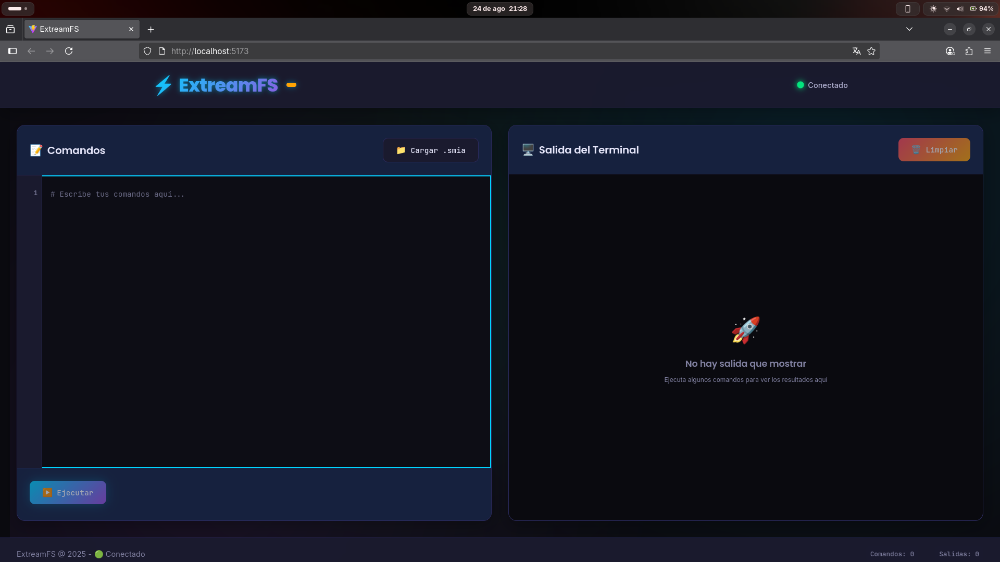
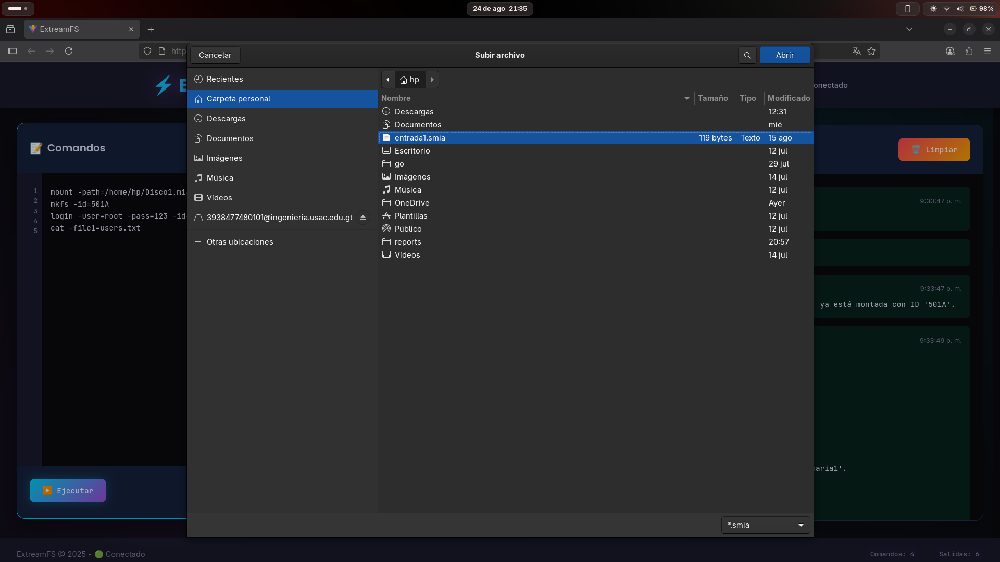
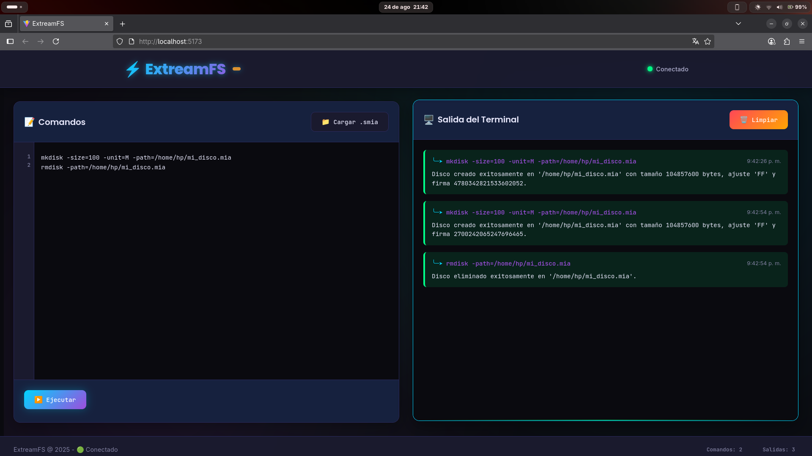
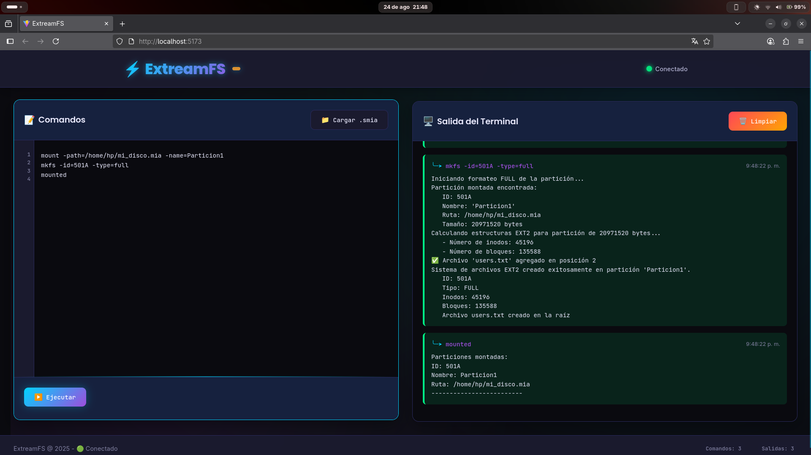
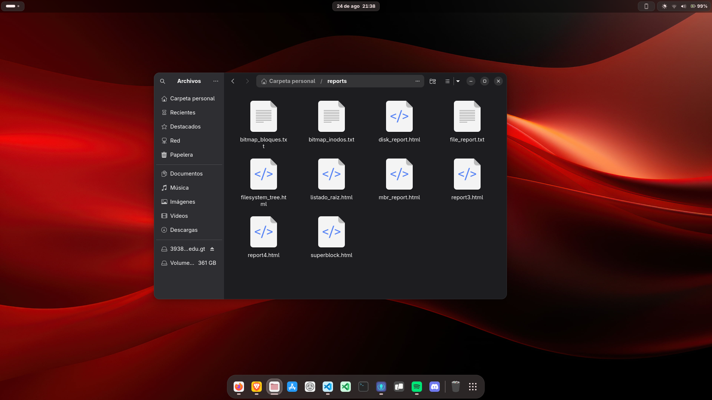
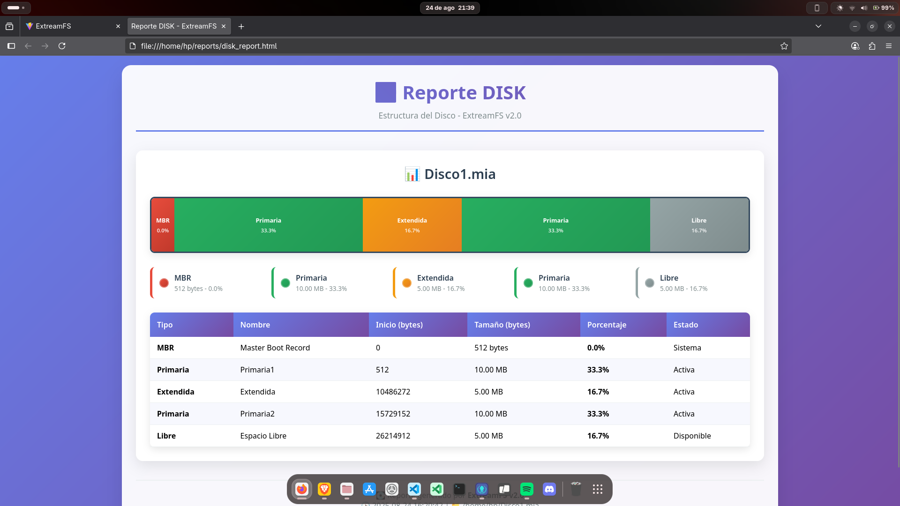

# Manual de Usuario 

---

## 📋 Tabla de Contenidos

1. [Introducción](#introducción)
2. [Instalación y Configuración](#instalación-y-configuración)
3. [Primeros Pasos](#primeros-pasos)
4. [Gestión de Discos](#gestión-de-discos)
5. [Gestión de Particiones](#gestión-de-particiones)
6. [Sistema de Archivos](#sistema-de-archivos)
7. [Usuarios y Permisos](#usuarios-y-permisos)
8. [Archivos y Directorios](#archivos-y-directorios)
9. [Operaciones Avanzadas](#operaciones-avanzadas)
10. [Journaling y Recuperación](#journaling-y-recuperación)
11. [Explorador de Archivos Visual](#explorador-de-archivos-visual)
12. [Generación de Reportes](#generación-de-reportes)
13. [Ejemplos Prácticos](#ejemplos-prácticos)
14. [Solución de Problemas](#solución-de-problemas)

---

##  Introducción

### ¿Qué es ExtreamFS?

ExtreamFS es una aplicación web que simula un sistema de archivos EXT2 completo. Te permite crear discos virtuales, gestionar particiones, crear usuarios y grupos, y manejar archivos y directorios tal como lo harías en un sistema Linux real.

### Características Principales

-  **Creación de discos virtuales**: Simula discos duros reales
-  **Gestión de particiones**: Crea y administra particiones primarias, extendidas y lógicas
-  **Sistema EXT2 completo**: Implementación fiel del sistema de archivos EXT2
-  **Usuarios y grupos**: Sistema completo de autenticación y permisos
-  **Journaling**: Sistema de registro de operaciones con recuperación
-  **Explorador visual**: Interfaz gráfica para navegar archivos
-  **Operaciones avanzadas**: Copiar, mover, renombrar, buscar archivos
-  **Control de permisos**: chmod, chown, chgrp
-  **Reportes visuales**: Genera reportes detallados en HTML, texto y gráficos
-  **Interfaz intuitiva**: Terminal simulada y explorador gráfico

### Requisitos del Sistema

- **Navegador web**: Chrome, Firefox, Safari o Edge (versiones recientes)
- **Conexión a internet**: Para cargar la aplicación web
- **Espacio en disco**: Variable según el tamaño de los discos virtuales que crees

---

## ⚙️ Instalación y Configuración

### Acceso a la Aplicación

1. **Abrir el navegador web** de tu preferencia
2. **Navegar a la dirección** donde esté hospedada la aplicación
3. **Esperar** a que la interfaz se cargue completamente

### Interfaz Principal

La interfaz de ExtreamFS simula una terminal de comandos con las siguientes secciones:

- **Área de comandos**: Donde escribes los comandos
- **Historial**: Muestra los comandos ejecutados anteriormente
- **Carga de archivos**: Permite subir archivos necesarios para cargar scripts completos
- **Explorador visual**: Navegación gráfica del sistema de archivos
- **Visor de journaling**: Muestra el historial de operaciones

** CAPTURA 1: Interfaz principal de ExtreamFS**



La interfaz principal muestra la terminal simulada donde podrás ejecutar todos los comandos del sistema.

---

##  Primeros Pasos

### Carga un archivo con extensión .smia

Para cargar un archivo con extensión .smia, haz clic en el botón "Cargar archivo (.smia)" y selecciona el archivo que deseas cargar desde tu sistema.



### Sintaxis de Comandos

Todos los comandos siguen esta estructura:
```
comando -parametro1=valor1 -parametro2=valor2
```

**Ejemplos:**
- `mkdisk -size=100 -unit=M -path=/tmp/disco1.mia`
- `fdisk -size=50 -unit=M -path=/tmp/disco1.mia -type=P -name=Particion1`

---

##  Gestión de Discos

### Crear un Disco Virtual

Para crear tu primer disco virtual, usa el comando `mkdisk`:

```bash
mkdisk -size=100 -unit=M -path=/home/usuario/mi_disco.mia
```

**Parámetros:**
- `size`: Tamaño del disco (obligatorio)
- `unit`: Unidad de medida
  - `B`: Bytes
  - `K`: Kilobytes  
  - `M`: Megabytes
- `path`: Ruta donde guardar el archivo (obligatorio)

### Eliminar un Disco

Para eliminar un disco que ya no necesites:

```bash
rmdisk -path=/tmp/disco_ejemplo.mia
```



---

##  Gestión de Particiones

### Crear Particiones

Usa el comando `fdisk` para crear particiones en tu disco:

```bash
fdisk -size=20 -unit=M -path=/tmp/disco_ejemplo.mia -type=P -name=Particion1
```

**Tipos de particiones:**
- `P`: Partición primaria
- `E`: Partición extendida
- `L`: Partición lógica

### Crear Múltiples Particiones

```bash
# Partición primaria de 20 MB
fdisk -size=20 -unit=M -path=/tmp/disco_ejemplo.mia -type=P -name=Sistema

# Partición extendida de 25 MB
fdisk -size=25 -unit=M -path=/tmp/disco_ejemplo.mia -type=E -name=Extendida

# Partición lógica dentro de la extendida
fdisk -size=10 -unit=M -path=/tmp/disco_ejemplo.mia -type=L -name=Datos
```

### Eliminar Particiones

```bash
fdisk -delete=full -path=/tmp/disco_ejemplo.mia -name=Datos
```

### Agregar Espacio a Particiones

```bash
fdisk -add=5 -unit=M -path=/tmp/disco_ejemplo.mia -name=Sistema
```


---

## 🖥️ Sistema de Archivos

### Montar una Partición

Antes de usar una partición, debes montarla:

```bash
mount -path=/tmp/disco_ejemplo.mia -name=Sistema
```

El sistema asignará automáticamente un ID (ejemplo: `501A`).

### Formatear la Partición

Después de montar, formatea la partición con EXT2:

```bash
mkfs -id=501A -type=full
```

**Tipos de formateo:**
- `full`: Formateo completo (recomendado)
- `fast`: Formateo rápido

### Verificar el Montaje

Para ver qué particiones están montadas:

```bash
mount
```



---

## 👥 Usuarios y Permisos

### Iniciar Sesión como Root

Después de formatear, inicia sesión como administrador:

```bash
login -user=root -pass=123 -id=501A
```

### Crear Grupos

```bash
# Crear grupo de usuarios regulares
mkgrp -name=usuarios

# Crear grupo de administradores
mkgrp -name=administradores
```

### Crear Usuarios

```bash
# Crear usuario regular
mkusr -user=juan -pass=123456 -grp=usuarios

# Crear usuario administrador
mkusr -user=admin -pass=admin123 -grp=administradores
```

### Cambiar de Usuario

```bash
# Cerrar sesión actual
logout

# Iniciar sesión como otro usuario
login -user=juan -pass=123456 -id=501A
```

### Gestión de Grupos

```bash
# Cambiar usuario de grupo
chgrp -user=juan -grp=administradores

# Eliminar usuario
rmusr -user=juan

# Eliminar grupo
rmgrp -name=usuarios
```

---

##  Archivos y Directorios

### Crear Directorios

```bash
# Crear un directorio simple
mkdir -path=/home

# Crear directorios anidados (con -p)
mkdir -path=/home/juan/documentos -p
```

### Crear Archivos

```bash
# Archivo vacío
mkfile -path=/home/juan/vacio.txt

# Archivo con tamaño específico (relleno con patrón 0-9)
mkfile -path=/home/juan/datos.bin -size=1024

# Archivo copiando contenido de otro archivo del sistema
mkfile -path=/home/juan/copia.txt -cont=/ruta/en/sistema/archivo_origen.txt
```

### Editar Archivos

Modifica el contenido de un archivo existente:

```bash
edit -path=/home/juan/carta.txt -cont=/ruta/nuevo_contenido.txt
```

**Nota:** El parámetro `-cont` debe apuntar a un archivo del sistema host que contenga el nuevo contenido.

### Ver Contenido de Archivos

```bash
# Mostrar contenido de un archivo
cat -file1=/home/juan/carta.txt

# Mostrar múltiples archivos
cat -file1=/home/juan/carta.txt -file2=/home/juan/notas.txt
```

---

## 🔧 Operaciones Avanzadas

### Cambiar Permisos (chmod)

Modifica los permisos de archivos y directorios:

```bash
# Cambiar permisos de un archivo
chmod -path=/home/juan/documento.txt -ugo=664

# Cambiar permisos recursivamente
chmod -path=/home/juan/proyecto -ugo=755 -r
```

**Formato de permisos:**
- Primer dígito: Permisos del propietario (User)
- Segundo dígito: Permisos del grupo (Group)
- Tercer dígito: Permisos de otros (Other)

**Valores:**
- `7` = rwx (lectura, escritura, ejecución)
- `6` = rw- (lectura, escritura)
- `5` = r-x (lectura, ejecución)
- `4` = r-- (solo lectura)
- `0` = --- (sin permisos)

### Cambiar Propietario (chown)

Cambia el propietario de archivos:

```bash
# Cambiar propietario de un archivo
chown -path=/home/juan/documento.txt -user=maria

# Cambiar propietario recursivamente
chown -path=/home/juan/proyecto -user=admin -r
```

### Cambiar Grupo (chgrp)

Cambia el grupo de archivos:

```bash
# Cambiar grupo de un archivo
chgrp -path=/home/juan/documento.txt -grp=administradores

# Cambiar grupo recursivamente
chgrp -path=/home/juan/proyecto -grp=usuarios -r
```

### Copiar Archivos y Directorios

Copia archivos o directorios completos:

```bash
# Copiar un archivo
copy -path=/home/juan/original.txt -dest=/home/maria/copia.txt

# Copiar un directorio completo
copy -path=/home/juan/proyecto -dest=/home/backup/proyecto
```

### Mover Archivos y Directorios

Mueve archivos o directorios a otra ubicación:

```bash
# Mover un archivo
move -path=/home/juan/documento.txt -dest=/home/maria/

# Mover un directorio
move -path=/home/juan/temporal -dest=/home/archivados/
```

### Renombrar Archivos y Directorios

Cambia el nombre de archivos o directorios:

```bash
# Renombrar un archivo
rename -path=/home/juan/viejo.txt -name=nuevo.txt

# Renombrar un directorio
rename -path=/home/juan/carpeta_vieja -name=carpeta_nueva
```

### Eliminar Archivos y Directorios

Elimina archivos o directorios:

```bash
# Eliminar un archivo
remove -path=/home/juan/temporal.txt

# Eliminar un directorio vacío
remove -path=/home/juan/carpeta_vacia
```

### Buscar Archivos

Busca archivos por nombre:

```bash
# Buscar en el directorio actual
find -path=/home/juan -name=documento.txt

# Buscar recursivamente
find -path=/home -name=*.txt
```

---

##  Journaling y Recuperación

### ¿Qué es el Journaling?

El sistema de journaling registra todas las operaciones realizadas en el sistema de archivos, permitiendo:
- Ver el historial de cambios
- Recuperar operaciones en caso de error
- Auditar acciones de usuarios

### Ver el Journal

Desde la interfaz web, haz clic en el botón **"Ver Journaling"** para abrir el visor de journaling.

El visor muestra:
-  **Operación realizada**: mkfile, mkdir, edit, remove, etc.
-  **Ruta del archivo/directorio**
-  **Contenido** (si aplica)
-  **Fecha y hora**
-  **Usuario** que realizó la operación
-  **Permisos** aplicados

**Ejemplo de entrada de journal:**

```
mkfile                    20/10/2025, 23:56:16
 /home/user/docs/test1.txt
Contenido: 0123456789012345678901234567890123456789...
 Usuario: root
 Permisos: 664
```

### Recuperación ante Pérdidas

Si el sistema detecta una pérdida de datos, puedes usar el comando de recuperación:

```bash
recovery -id=501A
```

Este comando restaura el sistema de archivos al último estado consistente registrado en el journal.

### Simular Pérdida de Datos

Para probar la función de recuperación, puedes simular una pérdida de datos eliminando el journal:

```bash
loss -id=501A
```

** Advertencia:** Esto eliminará todo el historial de operaciones y no se podrá recuperar.

---

##  Explorador de Archivos Visual

### Acceso al Explorador

Desde la interfaz principal, haz clic en **"Abrir Explorador de Archivos"** para acceder al explorador visual.

### Características del Explorador

- **Navegación intuitiva**: Haz clic en carpetas para navegar
- **Información detallada**: Muestra tamaño, permisos, propietario y grupo
- **Vista de árbol**: Navega por la ruta actual
- **Iconos visuales**: Diferencia entre archivos y directorios

### Visualización de Información

Cada archivo/directorio muestra:
- **Icono**: Tipo de elemento
- **Nombre**: Nombre del archivo o directorio
- **Tamaño**: En bytes
- **Permisos**: En formato rwx (ej: rw-r--r--)
- 👤 **Propietario**: Usuario dueño
- 👥 **Grupo**: Grupo asignado

**Ejemplo de vista:**

```
 Particion1
Ruta: /home/user/docs

 documento.txt      1024 B  rw-r--r--  👤 user  👥 users
 proyectos           512 B  rwxr-xr-x  👤 user  👥 users
 notas.md            256 B  rw-rw-r--  👤 user  👥 users
```

---

##  Generación de Reportes

### Tipos de Reportes Disponibles

ExtreamFS puede generar varios tipos de reportes para analizar el estado del sistema:



#### 1. Reporte de MBR

Muestra la estructura del Master Boot Record:

```bash
rep -id=501A -path=/home/reportes/mbr.html -name=mbr
```

#### 2. Reporte de Disco

Visualiza las particiones del disco:

```bash
rep -id=501A -path=/home/reportes/disco.html -name=disk
```

#### 3. Reporte de Superbloque

Detalla la información del superbloque:

```bash
rep -id=501A -path=/home/reportes/superbloque.html -name=sb
```

#### 4. Reporte de Inodos

Lista todos los inodos del sistema:

```bash
rep -id=501A -path=/home/reportes/inodos.html -name=inode
```

#### 5. Reporte de Bloques

Muestra los bloques de datos:

```bash
rep -id=501A -path=/home/reportes/bloques.html -name=block
```

#### 6. Bitmaps

```bash
# Bitmap de inodos
rep -id=501A -path=/home/reportes/bitmap_inodos.html -name=bm_inode

# Bitmap de bloques
rep -id=501A -path=/home/reportes/bitmap_bloques.html -name=bm_block
```

#### 7. Árbol del Sistema de Archivos

Genera una vista de árbol completa:

```bash
rep -id=501A -path=/home/reportes/arbol.html -name=tree
```

#### 8. Journaling

Exporta el historial de operaciones:

```bash
rep -id=501A -path=/home/reportes/journaling.html -name=journaling
```

#### 9. Listado de Directorio

Lista el contenido de un directorio específico:

```bash
rep -id=501A -path=/home/reportes/listado.html -name=ls -path_file_ls=/home
```

#### 10. Contenido de Archivo

Exporta el contenido de un archivo:

```bash
rep -id=501A -path=/home/reportes/archivo.txt -name=file -path_file_ls=/home/juan/carta.txt
```

### Visualizar Reportes

Los reportes HTML se pueden abrir en cualquier navegador web:



---

##  Ejemplos Prácticos

### Ejemplo 1: Configuración Inicial Completa

```bash
# 1. Crear disco de 100 MB
mkdisk -size=100 -unit=M -path=/tmp/sistema.mia

# 2. Crear partición primaria de 80 MB
fdisk -size=80 -unit=M -path=/tmp/sistema.mia -type=P -name=Sistema

# 3. Montar la partición
mount -path=/tmp/sistema.mia -name=Sistema

# 4. Formatear con EXT2
mkfs -id=501A -type=full

# 5. Iniciar sesión como root
login -user=root -pass=123 -id=501A

# 6. Crear estructura de directorios
mkdir -path=/home -p
mkdir -path=/home/usuarios -p
mkdir -path=/var/log -p
```

### Ejemplo 2: Gestión de Usuarios y Permisos

```bash
# 1. Crear grupos
mkgrp -name=desarrolladores
mkgrp -name=usuarios

# 2. Crear usuarios
mkusr -user=juan -pass=juan123 -grp=desarrolladores
mkusr -user=maria -pass=maria123 -grp=usuarios

# 3. Crear directorio de proyecto
mkdir -path=/home/proyecto -p

# 4. Cambiar propietario y permisos
chown -path=/home/proyecto -user=juan
chmod -path=/home/proyecto -ugo=755

# 5. Cambiar grupo
chgrp -path=/home/proyecto -grp=desarrolladores
```

### Ejemplo 3: Trabajo con Archivos

```bash
# 1. Crear archivo con contenido
mkfile -path=/home/documento.txt -size=1024

# 2. Ver contenido
cat -file1=/home/documento.txt

# 3. Editar archivo
edit -path=/home/documento.txt -cont=/tmp/nuevo_contenido.txt

# 4. Copiar archivo
copy -path=/home/documento.txt -dest=/home/backup/documento.txt

# 5. Renombrar archivo
rename -path=/home/documento.txt -name=doc_final.txt

# 6. Mover a otra ubicación
move -path=/home/doc_final.txt -dest=/var/documentos/
```

### Ejemplo 4: Búsqueda y Recuperación

```bash
# 1. Buscar archivo
find -path=/home -name=documento.txt

# 2. Ver journaling (desde interfaz web)
# Hacer clic en "Ver Journaling"

# 3. Recuperar sistema en caso de error
recovery -id=501A
```

---

## 🔧 Solución de Problemas

### Problemas Comunes

#### Error: "Comando no reconocido"

**Problema:** Aparece un mensaje indicando que el comando no se reconoce.

**Solución:**
1. Verifica la sintaxis del comando
2. Asegúrate de que todos los parámetros requeridos estén presentes
3. Consulta la lista de comandos disponibles

#### Error: "Partición no encontrada"

**Problema:** El sistema no puede encontrar una partición especificada.

**Solución:**
1. Verifica que el disco existe en la ruta especificada
2. Confirma que la partición fue creada correctamente
3. Usa el comando `rep -name=mbr` para ver las particiones existentes

#### Error: "Usuario no tiene permisos"

**Problema:** El usuario actual no tiene permisos para realizar una operación.

**Solución:**
1. Verifica que estás logueado como el usuario correcto
2. Cambia a un usuario con permisos apropiados (como root)
3. Verifica los permisos del archivo/directorio con el explorador visual
4. Usa `chmod` para modificar permisos si es necesario

#### Error: "Archivo ya existe"

**Problema:** Intentas crear un archivo que ya existe.

**Solución:**
1. Usa un nombre diferente
2. Elimina el archivo existente primero con `remove`
3. El sistema sobrescribirá automáticamente si tienes permisos

#### Error: "Directorio no vacío"

**Problema:** Intentas eliminar un directorio que contiene archivos.

**Solución:**
1. Elimina primero los archivos del directorio
2. Luego elimina el directorio vacío

#### Explorador de Archivos no Carga

**Problema:** El explorador visual no muestra archivos.

**Solución:**
1. Verifica que has iniciado sesión
2. Confirma que la partición está montada
3. Refresca la página del navegador

#### Journaling no Registra Operaciones

**Problema:** Las operaciones no aparecen en el visor de journaling.

**Solución:**
1. Verifica que el sistema está formateado con `mkfs -type=full`
2. Confirma que has iniciado sesión
3. El journaling se actualiza automáticamente tras cada operación
